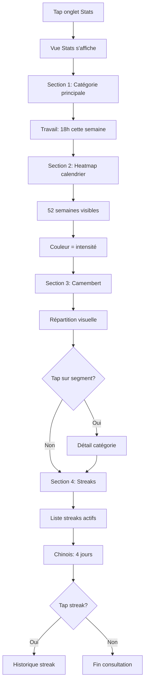

# UX Design Specification - appGestionTemps

**Author:** Alex
**Date:** 2026-02-04

---

## Executive Summary

### Project Vision

Application de gestion du temps personnelle (PWA) visant à transformer la relation de l'utilisateur avec son temps. Conçue mobile-first avec une approche "simplicité assumée" — chaque interaction doit être rapide et sans friction.

**Problème résolu:** Dispersion et manque de visibilité sur la répartition du temps entre activités (travail freelance, apprentissage, sport).

**Approche UX:** Timer 1-tap, visualisations motivantes (heatmap, streaks), gamification subtile non-stressante.

### Target Users

**Utilisateur principal:** Alex
- Développeur freelance multi-activités
- Tech-savvy, familier avec GitHub (heatmap)
- Usage mobile quotidien, sessions courtes
- Motivation: visibilité + régularité

**Utilisateur futur potentiel:** Toute personne cherchant à tracker son temps personnel de manière simple.

### Key Design Challenges

1. **Accès ultra-rapide** — Démarrer une session en 1 tap, zéro friction
2. **Timer persistant** — Visibilité constante du temps en cours, même en navigation
3. **Mobile-first PWA** — Touch-friendly, thumb-zone navigation, zones de tap généreuses
4. **Gamification équilibrée** — Streaks motivants sans créer de stress si manqué

### Design Opportunities

1. **Heatmap GitHub-style** — Visualisation familière et motivante, forte différenciation
2. **Identité par emojis** — Reconnaissance instantanée des catégories, personnalisation ludique
3. **Dashboard "at a glance"** — Répartition du temps visible en 2 secondes
4. **Simplicité comme feature** — Moins = mieux, contrainte dev solo transformée en avantage UX

## Core User Experience

### Defining Experience

**Action principale:** Démarrer/arrêter un timer sur une catégorie d'activité.

**Boucle d'usage:**
1. Ouvrir l'app → voir les catégories + stats du jour
2. Tapper une catégorie → timer démarre
3. Travailler → timer visible
4. Tapper stop → session enregistrée avec note optionnelle
5. Consulter stats → voir répartition et progression

**Fréquence:** Plusieurs fois par jour, sessions courtes (< 30 sec d'interaction).

### Platform Strategy

| Aspect | Décision |
|--------|----------|
| Type | PWA (Progressive Web App) |
| Interface principale | Touch (mobile-first) |
| Secondaire | Desktop (responsive) |
| Offline | Cache basique via Service Worker |
| Breakpoints | Mobile (<768px), Tablet (768-1024px), Desktop (>1024px) |

### Effortless Interactions

| Interaction | Objectif |
|-------------|----------|
| Démarrer timer | 1 tap depuis accueil |
| Voir stats du jour | Visible immédiatement à l'ouverture |
| Créer catégorie | < 30 secondes, 3 champs max |
| Consulter heatmap | 0 scroll dans section Stats |
| Ajouter note à session | Optionnel, rapide, non-bloquant |

### Critical Success Moments

| Moment | Impact |
|--------|--------|
| Premier timer terminé | Validation: "c'est simple, ça marche" |
| Premier carré vert heatmap | Motivation visuelle immédiate |
| Streak de 3 jours | Engagement établi, habitude en formation |
| Vue stats fin de semaine | Insight: "je comprends où va mon temps" |

### Experience Principles

1. **1-Tap First** — Toute action principale accessible en 1 tap maximum
2. **Glanceable** — Stats et état visibles en 2 secondes sans interaction
3. **Motivation douce** — Gamification encourageante, jamais culpabilisante
4. **Mobile-native** — Thumb-zone, gestes naturels, touch-first

## Desired Emotional Response

### Primary Emotional Goals

| Objectif | Description |
|----------|-------------|
| **Clarté** | L'utilisateur comprend instantanément où va son temps |
| **Contrôle** | Sentiment de maîtrise sur sa répartition du temps |
| **Fierté** | Satisfaction de voir sa régularité et ses progrès |
| **Bienveillance** | Jamais de culpabilité, même si objectifs non atteints |

### Emotional Journey Mapping

| Phase | Émotion cible |
|-------|---------------|
| Découverte (onboarding) | Curiosité → "C'est simple, je peux le faire" |
| Premier usage | Contrôle → "Je décide où va mon temps" |
| Usage régulier | Fierté → "Je suis régulier, ça se voit" |
| Consultation stats | Insight → "Je comprends mes patterns" |
| Streak cassé | Bienveillance → "C'est OK, on reprend demain" |
| Retour après pause | Accueil → "Content de te revoir" (pas de jugement) |

### Micro-Emotions

| État positif | État négatif à éviter |
|--------------|----------------------|
| Confiance | Confusion |
| Accomplissement | Frustration |
| Motivation | Pression |
| Fierté | Culpabilité |
| Calme | Anxiété |

### Design Implications

| Émotion | Approche UX |
|---------|-------------|
| Clarté | Interface épurée, stats "at a glance", zéro clutter |
| Contrôle | Actions 1-tap, feedback immédiat, état toujours visible |
| Fierté | Heatmap vert progressif, célébration subtile des streaks |
| Bienveillance | Messages neutres/positifs, pas de "vous avez échoué" |
| Motivation | Progression visible, petites victoires célébrées |

### Emotional Design Principles

1. **Zéro culpabilité** — L'app encourage, ne juge jamais
2. **Célébration subtile** — Reconnaître les succès sans excès
3. **Transparence bienveillante** — Montrer la réalité sans dramatiser
4. **Retour facile** — Toujours accueillant après une pause

## UX Pattern Analysis & Inspiration

### Inspiring Products Analysis

#### GitHub — Contribution Heatmap
- **Force:** Visualisation année complète, couleur = intensité, satisfaction de "remplir"
- **Pattern:** Densité visuelle = progression sans chiffres
- **Émotion:** Fierté silencieuse, motivation intrinsèque
- **À adopter:** Heatmap calendrier, dégradé gris → vert

#### Duolingo — Gamification bienveillante
- **Force:** Streaks motivants, "streak freeze", messages encourageants
- **Pattern:** Célébration sans pression, récupération possible
- **Émotion:** Motivation ludique, pas de culpabilité
- **À adopter:** Streaks positifs, sans punition si cassé
- **À éviter:** Notifications excessives

#### Toggl/Clockify — Time Tracking
- **Force:** Timer 1-click, catégorisation simple
- **Faiblesse:** Interface chargée, orientation pro/facturation
- **À adopter:** Démarrage rapide, historique récent
- **À éviter:** Complexité enterprise, rapports détaillés

### Transferable UX Patterns

**Navigation:**
- Bottom tab bar (Accueil / Stats / Catégories / Profil)
- Accueil = action principale immédiate

**Interaction:**
- 1-tap start (catégorie = démarrer timer)
- Swipe pour éditer/supprimer
- Pull-to-refresh stats

**Visualisation:**
- Heatmap calendrier style GitHub
- Camembert simple pour répartition
- Streaks discrets par catégorie

### Anti-Patterns to Avoid

| Anti-pattern | Raison |
|--------------|--------|
| Onboarding long | Friction → abandon |
| Notifications agressives | Crée anxiété |
| Trop de métriques | Surcharge cognitive |
| Rapports complexes | Confusion |
| Streak "perdu" dramatique | Culpabilité |

### Design Inspiration Strategy

**Adopter:**
- Heatmap GitHub (année, dégradé vert)
- Timer 1-tap style Toggl simplifié
- Bottom navigation standard mobile

**Adapter:**
- Streaks Duolingo → version douce sans pression
- Catégories → 2 niveaux max

**Éviter:**
- Interface pro/enterprise
- Gamification punitive
- Notifications pressantes

## Design System Foundation

### Design System Choice

**Choix:** Tailwind CSS + DaisyUI

| Aspect | Détail |
|--------|--------|
| Base CSS | Tailwind CSS (utility-first) |
| Composants | DaisyUI |
| Thème | Custom theme basé sur DaisyUI |
| Compatibilité | HTMX (zéro JS framework requis) |

### Rationale for Selection

1. **Rapidité de développement** — Composants prêts à l'emploi (buttons, cards, modals, tabs, inputs)
2. **Compatibilité HTMX** — DaisyUI est CSS-only, aucun conflit avec HTMX
3. **Dev solo optimisé** — Moins de code à écrire et maintenir
4. **Accessibilité intégrée** — Composants accessibles par défaut
5. **Theming natif** — Préparé pour mode sombre futur

### Implementation Approach

| Étape | Action |
|-------|--------|
| Installation | `npm install daisyui` + config Tailwind |
| Thème | Définir palette custom dans `tailwind.config.js` |
| Composants | Utiliser classes DaisyUI (`btn`, `card`, `modal`, etc.) |
| Custom | Étendre avec utilities Tailwind si besoin |

### Customization Strategy

**Palette de couleurs (à définir):**
- Primary: Couleur d'action principale (timer, CTA)
- Secondary: Couleur secondaire (catégories)
- Accent: Highlights et succès (streaks, heatmap vert)
- Neutral: Textes et fonds

**Composants à personnaliser:**
- Cards de catégories (avec emoji prominent)
- Timer display (grand, lisible)
- Heatmap (custom, inspiré GitHub)
- Bottom navigation (mobile-first)

**Composants DaisyUI à utiliser directement:**
- `btn` (boutons)
- `card` (conteneurs)
- `modal` (confirmations, notes)
- `input` (formulaires)
- `tabs` (navigation secondaire)
- `stat` (affichage stats)

## Defining Experience

### Core Interaction

**L'expérience définissante:**

> **"Tape une catégorie, ton temps commence"**

| Aspect | Détail |
|--------|--------|
| Action | 1 tap sur une catégorie |
| Résultat | Timer démarre instantanément |
| Équivalent | Le "swipe" de Tinder pour le time tracking |

### User Mental Model

| Aspect | Analyse |
|--------|---------|
| Problème actuel | Notes mentales, oublis, aucune visibilité sur le temps |
| Attente utilisateur | "Tracker mon temps sans effort ni friction" |
| Frustration avec alternatives | Trop d'étapes, interfaces complexes |
| Moment magique | Démarrer en 1 tap, voir les résultats immédiatement |

### Success Criteria

| Critère | Objectif |
|---------|----------|
| Temps pour démarrer timer | < 2 secondes après ouverture app |
| Nombre de taps requis | 1 seul |
| Feedback visuel | Timer visible immédiatement |
| Sentiment utilisateur | "C'est simple, ça marche" |

### Pattern Analysis

| Question | Réponse |
|----------|---------|
| Novel ou établi? | Établi (Timer 1-tap existe) |
| Notre différenciation | Catégories visuelles (emojis) + accès direct accueil |
| Métaphore utilisée | Chronomètre de sport — Start/Stop intuitif |

### Experience Mechanics

**1. Initiation:**
- Ouvrir l'app → catégories visibles sur accueil
- Chaque catégorie = carte avec emoji + temps du jour

**2. Interaction:**
- Tap sur catégorie → timer démarre
- Animation: carte pulse, timer apparaît
- Timer visible en permanence (header sticky)

**3. Feedback:**
- Timer en temps réel (update chaque seconde)
- Couleur de la catégorie active mise en avant
- Vibration légère au démarrage (mobile)

**4. Completion:**
- Tap "Stop" ou tap catégorie active
- Modal optionnel: "Ajouter une note?" (skip facile)
- Session enregistrée, retour accueil
- Stats/heatmap mis à jour visuellement

## Visual Design Foundation

### Color System

| Rôle | Couleur | Hex | Usage |
|------|---------|-----|-------|
| **Primary** | Bleu calme | `#3B82F6` | Actions principales, timer actif, CTA |
| **Secondary** | Gris ardoise | `#64748B` | Éléments secondaires, texte léger |
| **Accent/Success** | Vert GitHub | `#22C55E` | Heatmap, streaks, succès |
| **Warning** | Ambre doux | `#F59E0B` | Alertes non-critiques |
| **Error** | Rouge atténué | `#EF4444` | Erreurs (rare) |
| **Base** | Blanc | `#FFFFFF` | Fond principal |
| **Neutral** | Gris | `#F8FAFC` → `#1E293B` | Fonds secondaires, textes |

**Rationale:**
- Bleu = calme, concentration, contrôle
- Vert = progression, fierté (inspiré GitHub heatmap)
- Palette douce = bienveillance, zéro agressivité

### Typography System

| Élément | Police | Taille | Poids |
|---------|--------|--------|-------|
| H1 | Inter / System | 32px | 700 |
| H2 | Inter / System | 24px | 600 |
| H3 | Inter / System | 20px | 600 |
| Body | Inter / System | 16px | 400 |
| Small | Inter / System | 14px | 400 |
| Caption | Inter / System | 12px | 400 |
| Timer | JetBrains Mono | 48-64px | 500 |

**Rationale:**
- System fonts pour performance optimale PWA
- Monospace pour timer = alignement parfait des chiffres
- Hiérarchie claire pour scannabilité

### Spacing & Layout Foundation

**Échelle d'espacement (base 4px):**

| Token | Valeur | Usage |
|-------|--------|-------|
| `xs` | 4px | Micro-espacements |
| `sm` | 8px | Entre éléments liés |
| `md` | 16px | Padding standard |
| `lg` | 24px | Entre sections |
| `xl` | 32px | Marges principales |
| `2xl` | 48px | Séparations majeures |

**Layout:**

| Aspect | Mobile | Desktop |
|--------|--------|---------|
| Marges écran | 16px | 24px |
| Max-width content | 100% | 480px |
| Bottom nav height | 64px | N/A |
| Card spacing | 12px | 16px |

### Accessibility Considerations

| Critère | Standard | Implémentation |
|---------|----------|----------------|
| Contraste texte | WCAG AA 4.5:1 | Vérifié sur palette |
| Touch targets | 44x44px min | Boutons et zones tap |
| Focus visible | Ring visible | 2px primary color |
| Motion | Respecter préférences | `prefers-reduced-motion` |
| Labels | Tous les inputs | Labels explicites |

## Design Direction Decision

### Design Directions Explored

| Direction | Style | Évaluation |
|-----------|-------|------------|
| 1. Minimal Focus | Ultra-épuré, liste simple | Trop austère pour gamification |
| 2. Card Grid | Cartes colorées, emojis prominents | ✅ Choisi |
| 3. Dashboard First | Stats dominantes | Trop analytique, moins d'action |
| 4. Action Centered | Gros boutons, full-screen timer | Trop intense |

### Chosen Direction

**Direction 2: Card Grid**

| Aspect | Décision |
|--------|----------|
| Style | Cartes colorées avec emojis prominents |
| Layout | Grid 2 colonnes (mobile) |
| Timer | Banner sticky en header quand actif |
| Navigation | Bottom nav 3 items (Accueil, Stats, Settings) |
| Vibe | Playful, visuel, efficace |

### Design Rationale

1. **Emojis prominents** — Reconnaissance instantanée des catégories
2. **Grid layout** — Scan rapide, 1-tap accessible
3. **Cartes tactiles** — Touch-friendly, feedback visuel clair
4. **Timer sticky** — Toujours visible sans bloquer l'interface
5. **Compatible DaisyUI** — Cards, badges, stats natifs

### Implementation Approach

**Structure des écrans:**

| Écran | Header | Content | Navigation |
|-------|--------|---------|------------|
| Accueil | Timer actif ou résumé jour | Grid catégories | Bottom nav |
| Stats | Sélecteur période | Heatmap + Camembert + Streaks | Bottom nav |
| Settings | Titre | Liste options | Bottom nav |

**Composants clés:**

| Composant | Base | Personnalisation |
|-----------|------|------------------|
| Category Card | DaisyUI `card` | Emoji + temps + couleur |
| Timer Display | DaisyUI `stat` | Font mono, grande taille |
| Bottom Nav | DaisyUI `btm-nav` | 3 items (Home, Stats, Settings) |
| Heatmap | Custom | Style GitHub |
| Streak Badge | DaisyUI `badge` | Icône flamme |

## User Journey Flows

### Journey Flow 1 : Onboarding — "Alex configure son espace"

```mermaid
flowchart TD
    A[Compte créé] --> B[Écran d'accueil vide]
    B --> C[Message: "Créez votre première catégorie"]
    C --> D[Tap bouton "+"]
    D --> E[Modal création catégorie]
    E --> F[Saisir nom: "Travail"]
    F --> G[Sélectionner emoji: 🔨]
    G --> H[Choisir couleur]
    H --> I{Définir objectif?}
    I -->|Non| J[Tap "Créer"]
    I -->|Oui| K[Choisir type: jour/semaine]
    K --> L[Saisir valeur]
    L --> J
    J --> M[Catégorie apparaît sur accueil]
    M --> N{Autre catégorie?}
    N -->|Oui| D
    N -->|Non| O[Setup complet]
```

**Interactions clés :**

| Étape | Composant | Action |
|-------|-----------|--------|
| Création | Bouton "+" | Tap → Modal apparaît |
| Emoji | Picker emoji | Scroll + tap |
| Couleur | Palette | Tap sur couleur |
| Objectif | Toggle | Optionnel, skip facile |
| Validation | Bouton "Créer" | Tap → retour accueil |

**Durée cible :** < 30 secondes par catégorie

### Journey Flow 2 : Usage Quotidien — "Alex travaille"

```mermaid
flowchart TD
    A[Ouvrir app] --> B[Accueil: Grid catégories]
    B --> C[Voir stats du jour par catégorie]
    C --> D[Tap sur catégorie "Travail"]
    D --> E[Timer démarre instantanément]
    E --> F[Header sticky: timer actif]
    F --> G[Alex travaille...]
    G --> H{Action?}
    H -->|Pause| I[Tap pause]
    I --> J[Timer en pause]
    J --> K[Tap play]
    K --> G
    H -->|Stop| L[Tap stop]
    L --> M[Modal: "Ajouter une note?"]
    M --> N{Note?}
    N -->|Skip| O[Tap "Enregistrer"]
    N -->|Oui| P[Saisir note]
    P --> O
    O --> Q[Session sauvegardée]
    Q --> R[Retour accueil]
    R --> S[Stats jour mis à jour]
    S --> T[Heatmap: carré vert]
```

**Interactions clés :**

| Étape | Composant | Feedback |
|-------|-----------|----------|
| Start | Tap catégorie | Vibration légère, timer apparaît |
| Timer actif | Header sticky | Temps en temps réel (1x/sec) |
| Pause | Bouton pause | Timer gelé, couleur atténuée |
| Stop | Bouton stop | Modal note (skipable) |
| Save | Bouton enregistrer | Animation succès |

**Durée interaction :** 1 tap pour démarrer, 2 taps pour arrêter

### Journey Flow 3 : Consultation Stats — "Alex découvre ses patterns"



### Résumé des flux

| Journey | Taps requis | Durée cible | Emotion |
|---------|-------------|-------------|---------|
| Onboarding | 5-6 par catégorie | < 2 min total | Accomplissement |
| Start timer | 1 | < 2 sec | Contrôle |
| Stop + note | 2-3 | < 10 sec | Satisfaction |
| Voir stats | 1 (tab) | Instantané | Clarté |

## Wireframes & Screen Layouts

### Écran 1 : Accueil (Home)

```
┌─────────────────────────────────────┐
│  ≡  appGestionTemps      [+ Ajouter]│  ← Header
├─────────────────────────────────────┤
│                                     │
│  📊 Aujourd'hui: 4h 32min           │  ← Résumé jour
│                                     │
├─────────────────────────────────────┤
│                                     │
│  ┌─────────────┐  ┌─────────────┐   │
│  │     🔨      │  │     📚      │   │
│  │   Travail   │  │   Chinois   │   │  ← Grid catégories
│  │   3h 15min  │  │   45min     │   │     (2 colonnes)
│  └─────────────┘  └─────────────┘   │
│                                     │
│  ┌─────────────┐  ┌─────────────┐   │
│  │     💪      │  │     ➕      │   │
│  │    Sport    │  │   Ajouter   │   │
│  │   32min     │  │             │   │
│  └─────────────┘  └─────────────┘   │
│                                     │
├─────────────────────────────────────┤
│                                     │
│   🏠          📊          ⚙️        │  ← Bottom nav
│  Accueil     Stats     Settings     │
│                                     │
└─────────────────────────────────────┘
```

### Écran 2 : Timer Actif

```
┌─────────────────────────────────────┐
│  ← Retour                           │
├─────────────────────────────────────┤
│ ┌─────────────────────────────────┐ │
│ │  🔨 Travail                     │ │  ← Timer banner
│ │                                 │ │     (sticky)
│ │        01:23:45                 │ │  ← Temps (mono)
│ │                                 │ │
│ │    [ ⏸️ ]      [ ⏹️ ]           │ │  ← Contrôles
│ │    Pause       Stop             │ │
│ └─────────────────────────────────┘ │
├─────────────────────────────────────┤
│                                     │
│  Sessions aujourd'hui               │
│  ─────────────────────              │
│  09:15 - 10:30  │  1h 15min         │  ← Historique
│  "Intégration API client"           │     du jour
│  ─────────────────────              │
│  14:00 - 15:45  │  1h 45min         │
│  "Debug authentification"           │
│                                     │
├─────────────────────────────────────┤
│   🏠          📊          ⚙️        │
└─────────────────────────────────────┘
```

### Écran 3 : Stats

```
┌─────────────────────────────────────┐
│  📊 Statistiques                    │
│  [Jour] [Semaine] [Mois]            │  ← Tabs période
├─────────────────────────────────────┤
│                                     │
│  Cette semaine: 23h 15min           │
│                                     │
│  🔨 Travail      18h    ████████░   │
│  📚 Chinois       3h    ███░░░░░░   │  ← Barres progress
│  💪 Sport         2h    ██░░░░░░░   │
│                                     │
├─────────────────────────────────────┤
│           HEATMAP                   │
│  ┌───────────────────────────────┐  │
│  │ L M M J V S D                 │  │
│  │ ░ █ █ ░ █ ░ ░  ← Semaine -3   │  │  ← Heatmap
│  │ █ █ █ █ █ ░ ░  ← Semaine -2   │  │     GitHub-style
│  │ █ █ ░ █ █ █ ░  ← Semaine -1   │  │
│  │ █ █ █ █ ░ ░ ░  ← Cette sem.   │  │
│  └───────────────────────────────┘  │
│                                     │
├─────────────────────────────────────┤
│      ┌─────────┐                    │
│     /    78%    \   🔨 Travail      │
│    │            │   📚 13%          │  ← Camembert
│     \    9%    /    💪 9%           │
│      └─────────┘                    │
│                                     │
├─────────────────────────────────────┤
│  🔥 Streaks actifs                  │
│  ┌─────────────────────────────┐    │
│  │ 📚 Chinois    4 jours  🔥🔥 │    │  ← Streaks
│  │ 🔨 Travail    2 jours  🔥   │    │
│  └─────────────────────────────┘    │
├─────────────────────────────────────┤
│   🏠          📊          ⚙️        │
└─────────────────────────────────────┘
```

### Écran 4 : Modal Création Catégorie

```
┌─────────────────────────────────────┐
│                                     │
│  ┌───────────────────────────────┐  │
│  │                           ✕   │  │
│  │  Nouvelle catégorie           │  │
│  │                               │  │
│  │  Nom                          │  │
│  │  ┌─────────────────────────┐  │  │
│  │  │ Travail                 │  │  │
│  │  └─────────────────────────┘  │  │
│  │                               │  │
│  │  Emoji                        │  │
│  │  [🔨] [📚] [💪] [🎮] [🎵]...  │  │
│  │                               │  │
│  │  Couleur                      │  │
│  │  [🔵] [🟢] [🟡] [🟠] [🔴]     │  │
│  │                               │  │
│  │  ☐ Définir un objectif        │  │
│  │                               │  │
│  │  ┌─────────────────────────┐  │  │
│  │  │       Créer             │  │  │
│  │  └─────────────────────────┘  │  │
│  │                               │  │
│  └───────────────────────────────┘  │
│                                     │
└─────────────────────────────────────┘
```

### Écran 5 : Modal Note (après stop timer)

```
┌─────────────────────────────────────┐
│                                     │
│  ┌───────────────────────────────┐  │
│  │                               │  │
│  │  Session terminée             │  │
│  │                               │  │
│  │  🔨 Travail                   │  │
│  │  Durée: 2h 15min              │  │
│  │                               │  │
│  │  Note (optionnel)             │  │
│  │  ┌─────────────────────────┐  │  │
│  │  │ Intégration API...      │  │  │
│  │  │                         │  │  │
│  │  └─────────────────────────┘  │  │
│  │                               │  │
│  │  [Passer]    [Enregistrer]    │  │
│  │                               │  │
│  └───────────────────────────────┘  │
│                                     │
└─────────────────────────────────────┘
```

### Responsive Breakpoints

| Breakpoint | Grid catégories | Layout |
|------------|-----------------|--------|
| Mobile (<768px) | 2 colonnes | Stack vertical |
| Tablet (768-1024px) | 3 colonnes | Side stats optionnel |
| Desktop (>1024px) | 4 colonnes | Layout 2 panneaux |

### Composants DaisyUI mappés

| Wireframe Element | Composant DaisyUI |
|-------------------|-------------------|
| Category Card | `card card-compact` |
| Timer Display | `stat` + custom mono font |
| Bottom Nav | `btm-nav` |
| Modal | `modal modal-bottom sm:modal-middle` |
| Period Tabs | `tabs tabs-boxed` |
| Progress Bars | `progress progress-primary` |
| Buttons | `btn btn-primary`, `btn btn-ghost` |
| Input | `input input-bordered` |
| Badge Streak | `badge badge-accent`
